# Drumloot - Intro

Drum Loot is a full-stack, responsive website build for my Code Institute Full-stack development program using Django framework.<br>
Drumloot is an E-commerce store where users can search and purchase drums and drum related accessories. Users are able to sign up for an account by filling in their personal information on the website’s profile page, leave a review and fill in a contact form. In addition, users are able to subrsibe to the Drum Loot Newsletter using MailChimp. Social Media links are easily accessible from this website.


[Live Project Here](https://project-5-drumloot-2349a17dd7f8.herokuapp.com/)

<p align="center"></p>

README Table Content

- [Drumloot - Intro](#drumloot---intro)
  - [User Experience - UX](#user-experience---ux)
    - [User Stories](#user-stories)
    - [Agile Methodology](#agile-methodology)
    - [The Scope](#the-scope)
  - [Design](#design)
      - [Colours](#colours)
      - [Typography](#typography)
      - [Imagery](#imagery)
    - [Wireframes](#wireframes)
  - [Entity Relationship](#entity-relationship)
  - [Features](#features)
    - [Homepage](#homepage)
    - [Products Page](#products-page)
    - [Products Details - Special offers](#products-details---special-offers)
    - [Products Details - Out of Stock](#products-details---out-of-stock)
    - [Products Categories](#products-categories)
    - [Products Shopping Cart](#products-shopping-cart)
    - [Products Checkout](#products-checkout)
    - [Products Management](#products-management)
    - [Profile Page](#profile-page)
      - [Edit Review Form](#edit-review-form)
      - [Add/Edit Service Review Page](#addedit-service-review-page)
    - [Navbar](#navbar)
    - [Footer](#footer)
    - [Page 404 - Page Not Found](#page-404---page-not-found)
    - [Messages](#messages)
  - [Marketing and Social Media](#marketing-and-social-media)
    - [Statista - Facebook Users](#statista---facebook-users)
    - [Drumloot - Facebook Page](#Drumloot---facebook-page)
    - [Mailchimp Subscription Service](#mailchimp-subscription-service)
  - [Privacy Policy](#privacy-policy)
  - [Search Engine Optimization](#search-engine-optimization)
    - [sitemap.xml](#sitemapxml)
    - [robots.txt](#robotstxt)
    - [Sitemap Google Registration](#sitemap-google-registration)
  - [AWS Setup Process](#aws-setup-process)
    - [AWS S3 Bucket](#aws-s3-bucket)
    - [IAM Set Up](#iam-set-up)
    - [Connecting AWS to the Project](#connecting-aws-to-the-project)
  - [Stripe Payments](#stripe-payments)
    - [Payments](#payments)
    - [Webhooks](#webhooks)
  - [Technologies Used](#technologies-used)
    - [Languages Used](#languages-used)
    - [Django Packages](#django-packages)
    - [Frameworks - Libraries - Programs Used](#frameworks---libraries---programs-used)
    - [Testing](#testing)
  - [Creating the Django app](#creating-the-django-app)
  - [Deployment of This Project](#deployment-of-this-project)
  - [Final Deployment](#final-deployment)
  - [Forking This Project](#forking-this-project)
  - [Cloning This Project](#cloning-this-project)
  - [Credits](#credits)
    - [Content](#content)
    - [Information Sources / Resources](#information-sources--resources)
  - [Special Thanks](#special-thanks)


## User Experience - UX

### The Scope

The goal of this project was to provide users with a functioning e-commerce store. To contain relevant imagery, and a wide array of products to support a good website experience.
Allow customers to quickly and easily browse products in an intuitive manner. Enable users to add feedback to the store, edit their feedback and delete. 
Provide CRUD functionality to users and admins. To provide a safe and secure method of purchasing their products.

### User Stories

- As a website user, I can:

1. Navigate around the site and easily view the desired content.
2. View a list of products and choose accordingly.
3. Create an account with the website.
4. Search products to find a specific product.
5. Click on a product to read and view the details.
6. Register for an account to avail of the services offered to members.
7. Buy a product by using the website checkout system.
8. Feel secure when using the checkout system.

- As a logged in website user, I can:

1. Add a review for the website.
2. Delete reviews that I have added.
3. Edit my previous reviews.
4. Update my personal information on my profile.
5. Manage my profile by updating my details.
6. Change my account password
7. Logout of the website.
8. Save my details to my profile on checkout.
9. On my next purchase my saved profile information will automatically load on checkout.

- As a website Superuser, I can:

1. Add a new product.
2. Edit an existing product.
3. Update product information such as putting it on sale or out of stock.
4. Delete users, reviews, products, categories, special offers.
5. Approve user's reviews.
6. Edit user information.


### Agile Methodology

All features added were done through GitHub's project management ticketing system
[here](https://github.com/users/GaryS007/projects/3)

## Design

#### Colours

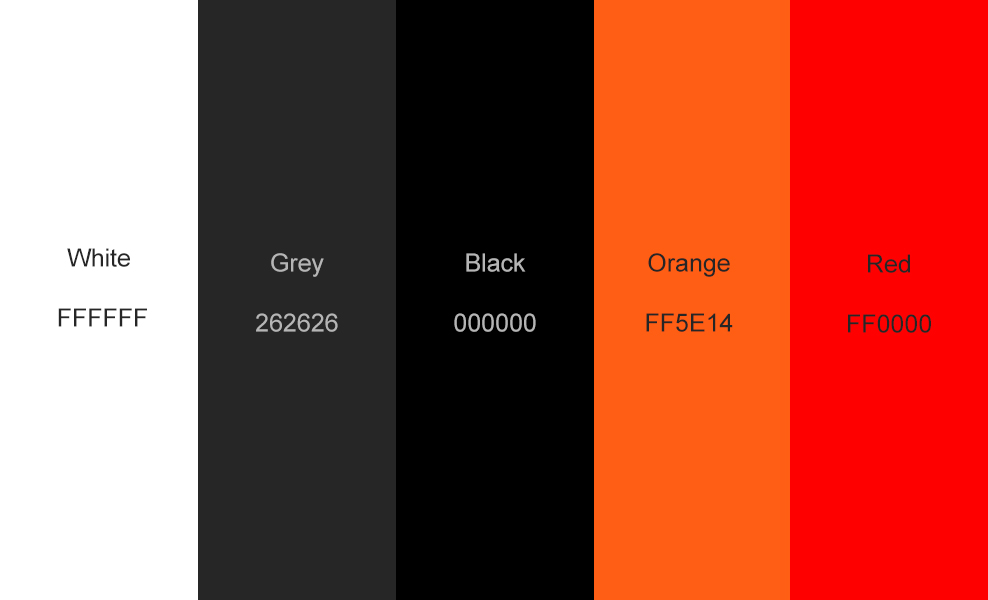<br>

- The colour scheme is a nice dark grey contrast with the white and then a pop of orange. It adds a very professional look and feel, bringing necessary attention to buttons/links with the bright orange colour. Maintaining Black & White for primary colours is important to the store as they're stastically the best colours to use. The orange was punchy just like the drums!

#### Typography & Icons

- Poppins font was used throughout the website, for all text, nav and website logo.
- Font Awesome was used to generate all icons through the website.

#### Imagery

- All images were reszied accordingly to best suit to the content. Images can be uploaded through Django admin but also using CRUD functionality on the Product and Reviews page.

### Wireframes

Wireframes for this project are located [here](WIREFRAMES.md)

## Entity Relationship

<br>

## Features

### Homepage

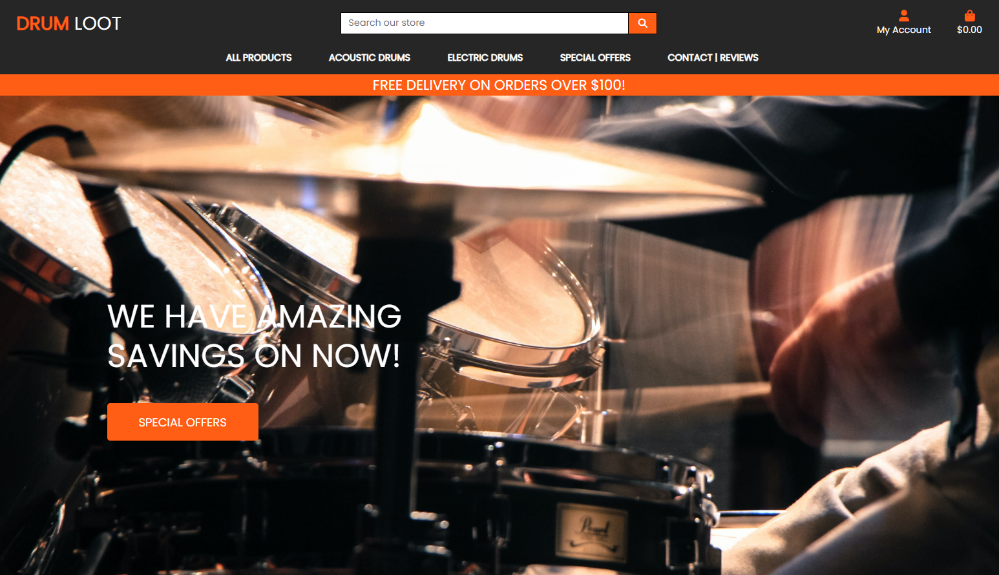

- The landing page is an instantly vibrant landing page. Providing a proffesional feel with all necessary navigation to start shopping.<br>

### Products Page

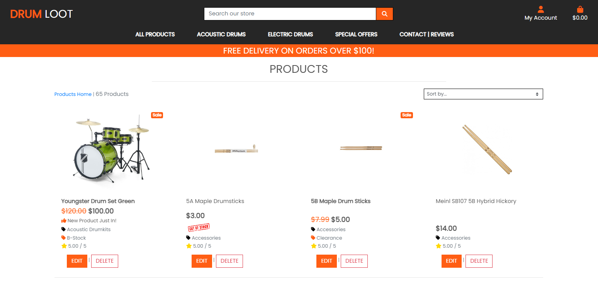

- This is the primary page that allows customers to browse products. They can sort products by price, name, category and rating. Any deals are made obvious by sales banners, out of stock banners.<br>

### Products Details - Special offers

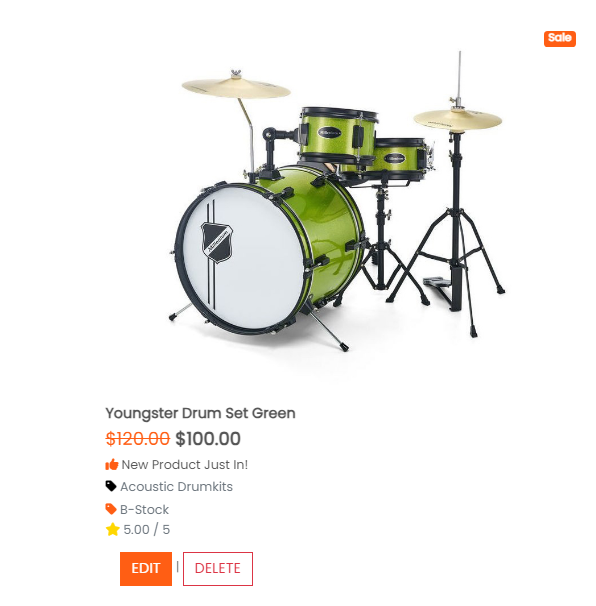

- This feature allows admins to choose which products can be featured in special offers. Prices will be slashed, displaying the new price and a sale banner over the image<br>


### Products Shopping Cart - Products Out of Stock

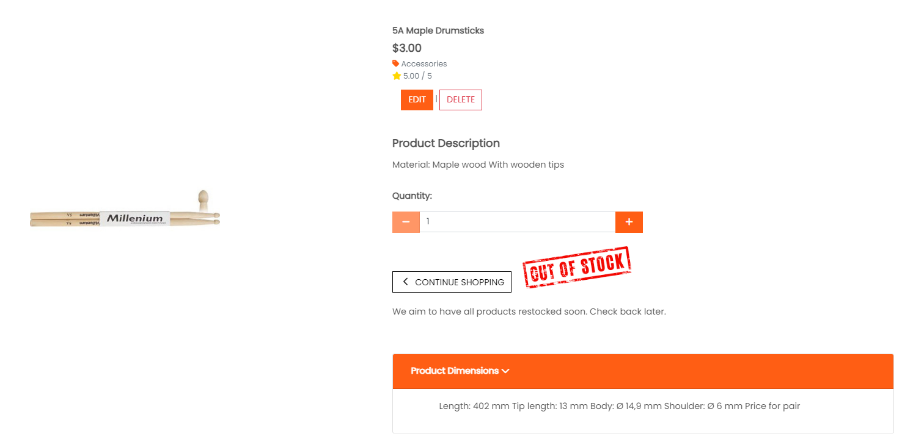

- As users scroll they can see instantly what items are out of stock. If they click through to the product, the out of stock banner replaced the add to cart button.<br>

### Products Shopping Cart

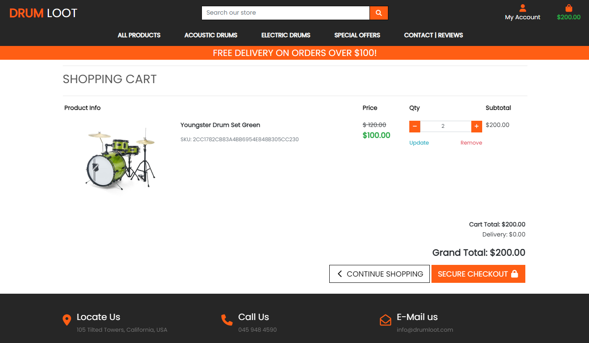

- This section allows customers to view what items have been added into their shopping cart. They can adjust the quantity and see the price reflect their changes after updating the shopping cart.<br>

### Products Checkout

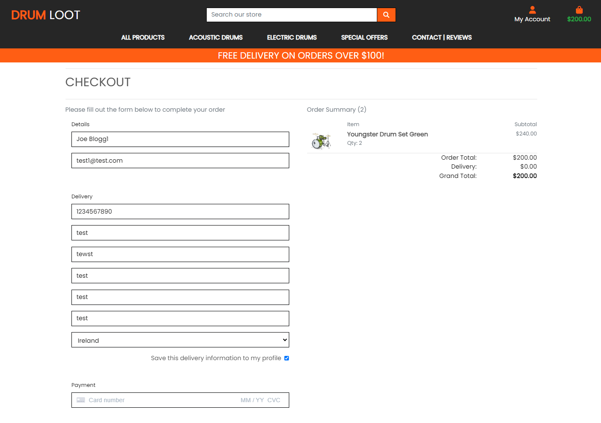

- The checkout page uses stripe for payments and has a simple form for the customer to fill out. They can save their details for future convenience if they have an account.<br>

### Products Checkout - Success

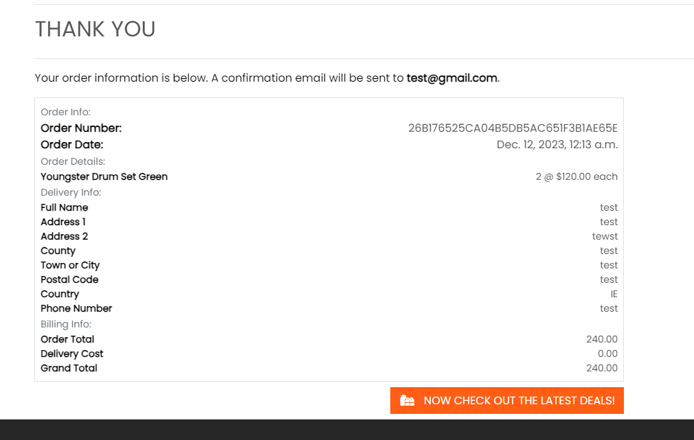

- On the checkout page, users will have to fill out the form and add their credit/debit card details to finish the purchase.<br>

### Products Management

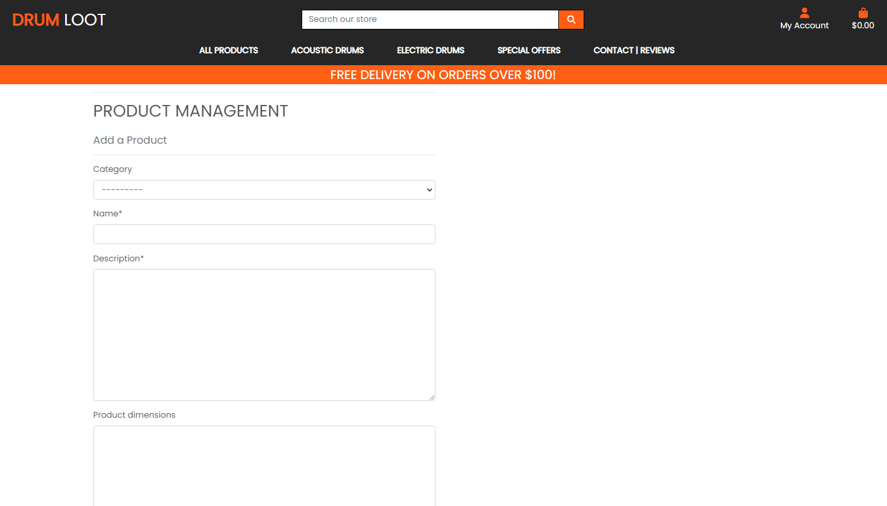

- Once a superuser is logged in, they can add products via the add product page. This page can be access by Project Management in the superusers profile.<br>

### Profile Page

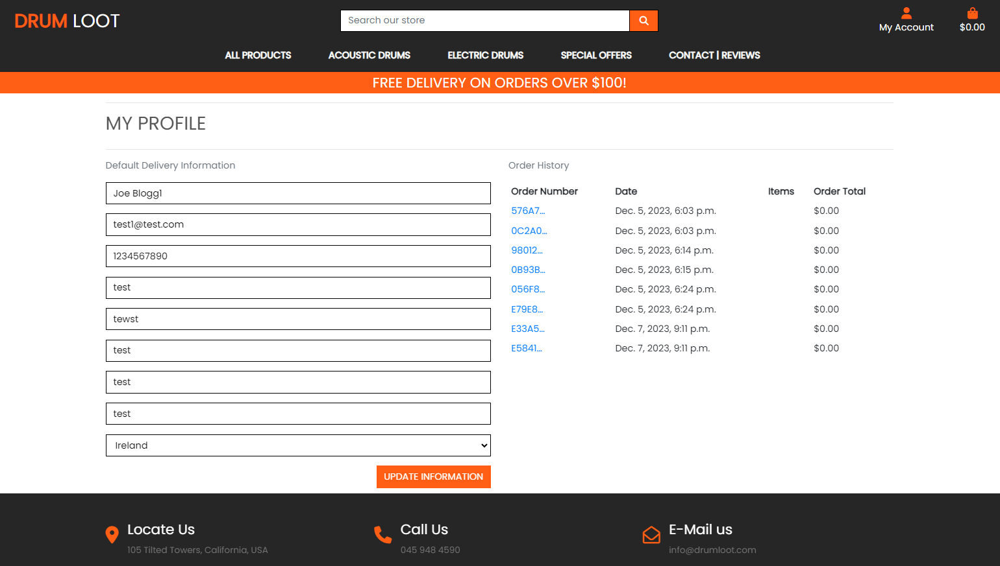

- On this profile page, users can edit/update their profile details but also view all of their recent order history.<br>

#### Reviews Page

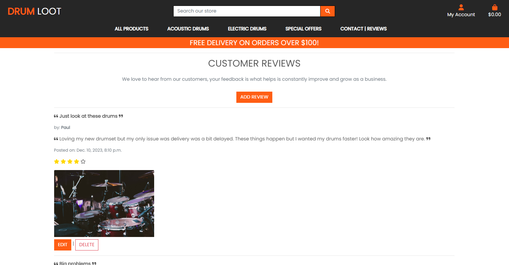

- The reviews page allows website vistors and users to view reviews. If you are a user, you can add a review.<br>

#### Add/Edit Service Review Page

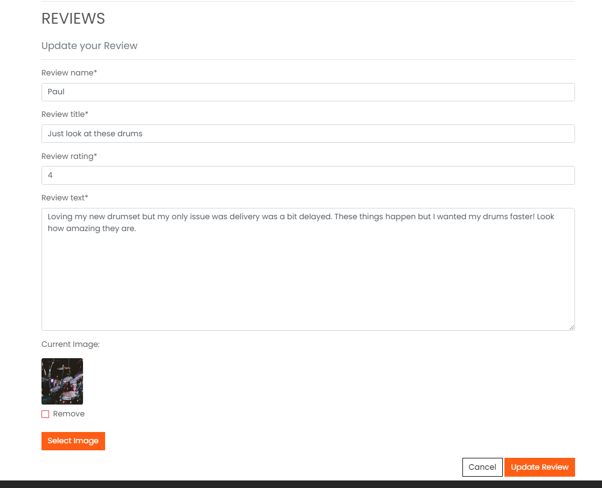

- This page allows the validated user to post a review of their store / shopping experience.<br>

### Navbar

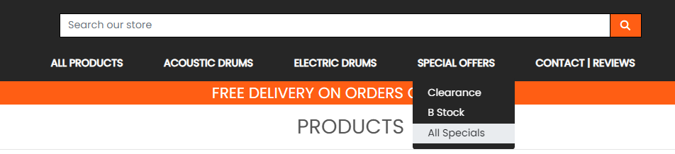

- The navbar is present on all pages. It includes relevant links to all pages.
- The navbar has dropdown functionality to make the navigation more fluid.
- The Searchbar sits above the navbar to make it obvious you can search for specific products quickly.
- The logo is a quick easy way to go back to the homepage.
- The My Account icon allows visits to register an account.
- When a user has register, the My Account icon changes to dropdowns for Profile and Logout.
- The checkout icon contains the price a user has added a product to their cart. They can click this to proceed to checkout.
- The navbar is responsive and will change to a burger menu on mobile devices.<br>

### Footer

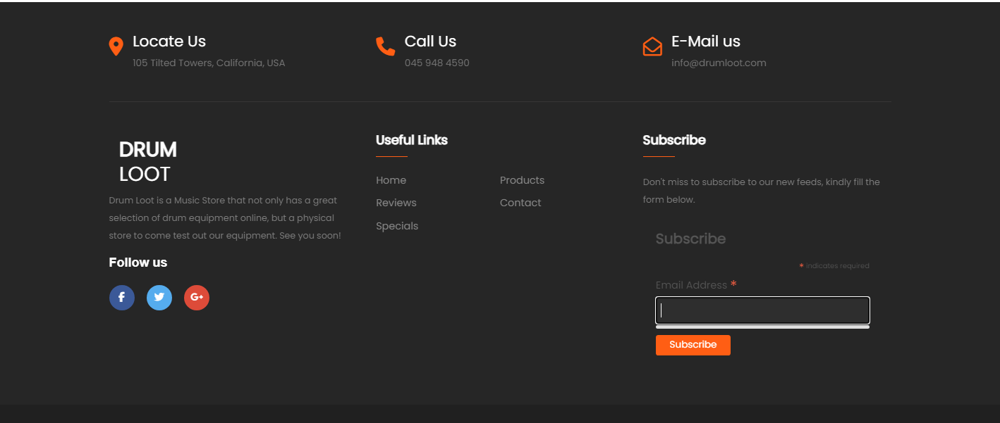

- The footer contains information about the store such as social media links, relevant website links, contact info and the ability to subscribe to Drum Loots newsletter.<br>

### Page 404 - Page Not Found


- The custom 404 page will replace the standard 404 error page when a user visits a URL that does not exist.<br>  

### Messages

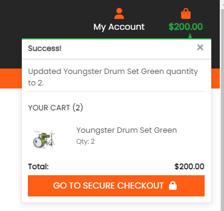

- Message notifications will appear throughout the customer journey to provide notifications of items being added to the cart, reviews added, successful purchases and so on.

## Marketing

- Since Drum Loot is not only an online store but a physical one. We want to ensure our marketing covers both bases. Social Media Marketing can be done via Facebook and Instagram to promote the brands and sales we have currently to new potential customers but also existing ones. The target demographic for the store ranges from 12-65. This is a wide age range and as a result marketing will need to reflect this. To target a younger audience we would likely target parents who would be purchasing drums as a gift for their children. Our Facebook page can include photography, relevant offers and drum demonstrations to showcase the equipment we have for sale.<br>

### Drumloot - Facebook Page

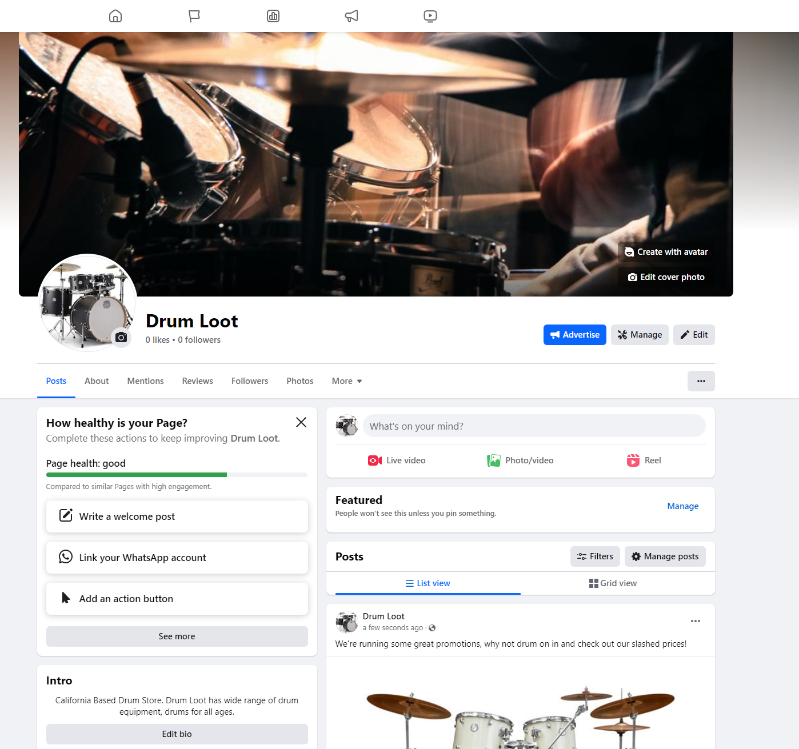


- [Drumloot Facebook Page](https://www.facebook.com/profile.php?id=61554500882267)<br>

### Mailchimp Subscription Service

- Mailchimp was used for this website so users can sign up to our newsletters so we can send appropriate emails to notify them of the latest offers and general news about our store and all things drumming.
- Mailchimp provided embeddable code making integration seamless and easy.

## Privacy Policy

- I generated a privacy policy to provide further condifence to users when using the website using - [Privacy Policy Generator](https://www.privacypolicygenerator.info/) This privacy policy is up to date with Californian privacy laws.<br>

 - You can access Drum Loots privacy policy [here](https://www.termsfeed.com/live/962a6ed6-581a-45a0-be10-62338762ce9a)

## Search Engine Optimization

- The website was optimized using various keywords for Drum Loots target audience. The audience ranging of all ages. Since this is not online an online store but a physical store, we are marketing to local consumers as well as globally. Each search term was chsoen based on popular search terms used for other drum store competitors. Some of which are more common than others and will harder to reach higher rankings. <br>

<br>

### sitemap.xml

- A sitemap was generated by sitemaps.org with a list of all important URLs which was added automatically by xml.sitemaps to ensure search engines are able to navigate through the website.
- To do this you can follow these simple instructions:

1. Visit xml.sitemaps.org and enter the URL of a deployed site.
2. Click Download on the provided XML File
3. ensure the file is named sitemap.xml and add it into the project root folder.<br>

### robots.txt

- A robots.txt file was added to tell search engines not to visit certain parts of the website such as login pages or account pages that can't be accessed by the public. This can improve the SEO rating..

### Sitemap Google Registration

- To ensure that the Google engine will check the website sitemap file I have registered the Drumloot URL on the Google Search Console.

## Deployment

**1 - Database Setup** - I setup PostgreSQL database using ElephantSQL, I used these steps:
    - Create an account for ElephantSQL
    - Create a new instance with a unique name.
    - Select Tiny Turtle Plan (It's Free).
    - Select the closest region to you.
    - After it's created, document the Database URL and password.
<br>

____

**2 - Cloudinary API Integration** - To store media files online, I needed to integrate the Cloudinary API into my application by following these steps:
    - Create an account with Cloudinary.
    - On the Cloudinary Dashboard get your API Environment Variable
    - Copy the API key.
    - Add the API Key to the "DATABASE_URL" variable.
    - Be sure to install the package in your environment - pip3 install django-cloudinary-storage
<br>

____

**3 - Deploying on Heroku:**
    - Create an account with Heroku.
    - Create your new app via the Heroku Dashboard.
    - Access your app settings and set up Config Vars:
        - CLOUDINARY_URL - Copy and Paste your Cloudinary API Key.
        - DATABASE_URL - Use the ElphantSQL Postgres DB URL here.
        - SECRET_KEY - Generate a Secret Key in Django for this (I used [Django Secret Key Generator](https://djecrety.ir/))
        - DISABLE_COLLECTSTATIC=1 - I have this set during the building phase, prior to deployment.
    - Connect GitHub Repo to your Heroku App.
    - During the build phase I manually Pushed my code when needed. When I was ready to do my final deploy, I set it to automatic.
    - **Additional Notes** - Ensure you have your requirements.txt file updated after all package installs with pip3 freeze > requirements.txt in the terminal.
    - **Additional Notes** - Ensure you create your Procfile, to do this run this command - web: gunicorn projectfolder.wsgi:application (Replace projectfolder with your own name).

____

**4 - Create the env.py file**
With the database created and your initial Heroku setup completed. You now need to connect it within the project. Specific variables need to be kept secure and cannot be published to GitHub.
    - Create an env.py file and add it to .gitignore.
    - Put 'import os' at the top of the file. Set the DATABASE_URL variable using the ``os.environ`` method. Add the URL from your DB here like this - `` os.environ["DATABASE_URL"] = "secureURL" ``
    - Your SECRET_KEY you put into Heroku Config Vars needs to be entered into your env.py as well. ``os.environ["SECRET_KEY"] = "SecretKey"

____

**5 - Update settings.py file**
* Next we need to make our project aware of the env.py file in order to connect our environment to the new database.
    - Add the following if statement which allows the application to run without the env.py file:
    ```
        import os
    import dj_database_url

    if os.path.isfile(‘env.py’):
        import env
    ```
____

<br>

* Replace the insecure secret key provided by Django with:
    ``SECRET_KEY = os.environ.get('SECRET_KEY')``

* When testing and working locally, leave ``DEBUG = True`` in your settings.py file. When you are pushing to production, change this to ``DEBUG = False``

* Change the existing DB connection in settings.py to use a URL. Comment out the following:
```
        DATABASES = {
        'default': {
            'ENGINE': 'django.db.backends.sqlite3',
            'NAME': os.path.join(BASE_DIR, 'db.sqlite3'),
        }
    }
```

Replace with this.
``
    DATABASES = {'default': dj_database_url.parse(os.environ.get('DATABASE_URL')) }
``
____

* **Cloudinary & Whitenoise** - I used both Cloudinary and Whitenoise in my project, cloudinary for imagery and whitenoise for serving static files. As a result my set up was a bit unique.
    - Update your INSTALLED_APPS ensuring that they are in the correct order. Like so:
```
    'django.contrib.staticfiles',
    'cloudinary_storage',
    'cloudinary',
```
    - Add the following under MIDDLEWARE:
```
MIDDLEWARE = [
    'whitenoise.middleware.WhiteNoiseMiddleware',
]
```
    - You will need to go to the Cloudinary &
```
        MEDIA_URL = '/media/'
DEFAULT_FILE_STORAGE = 'cloudinary_storage.storage.MediaCloudinaryStorage'

STATIC_URL = '/static/'
STATICFILES_STORAGE = 'whitenoise.storage.CompressedManifestStaticFilesStorage'  # noqa
# STATICFILES_STORAGE = 'cloudinary_storage.storage.StaticHashedCloudinaryStorage'  # noqa

# STATICFILES_DIRS = [os.path.join(BASE_DIR, 'static')]
STATICFILES_DIRS = (os.path.join(BASE_DIR, 'static'),)
STATIC_ROOT = os.path.join(BASE_DIR, 'staticfiles')
```
____

* **Add Heroko Host Name**

In settings.py go to ALLOWED_HOSTS and add the Heroku Host name. When testing locally, you will also need to include the URL for your website after typing python3 manage.py runserver. 'localhost' can work, but for me it didn't.
This 8000-garys007 url reset for me on a weekly basis, so when you go to runserver and get an error. It will provide the new URL, simply replace the old one.
```
ALLOWED_HOSTS = [
    'project-5-drumloot-2349a17dd7f8.herokuapp.com',
    '8000-garys007-portfolioproje-3x6u80hitj3.ws-eu104.gitpod.io'
    ]
```

____

* **Forking Github Repo**

    - Locate the Github Repo, Link can be found [here](https://github.com/GaryS007/Portfolio-Project-4).
    - Click 'Fork' at the top right hand corner.
    - This will redirect you to your own repository to a fork with the same name as the original branch.

____

* **Creating a Local Clone**
    - Locate the Github Repo, Link can be found [here](https://github.com/GaryS007/Portfolio-Project-4).
    - Click on 'Code' over on the right hand side. Select HTTPs from the drop down and copy the URL.
    - Open Git Bash in your IDE and change the current working directory to the new location where you want the cloned directory.
    - Type ``git clone``, then simply paste the URL you copied in step 2.

You can read more information on how to do this through the offical GitHub Documentation [here](https://docs.github.com/en/repositories/creating-and-managing-repositories/cloning-a-repository).

[Back to Top](#table-of-contents)


10. Navigate back to your AWS S3 Bucket and click on "Create Folder" name this folder "media", within the media file click "Upload > Add Files" and select the images for your site.
11. Under "Permissions" select the option "Grant public-read access" and click "Upload".

## Stripe Payments

- The Stripe payments system is set up as the online payment processing and credit card processing platform for the purchases. You will need a stripe account which you can sign up for [here](https://stripe.com/en-ie)

### Payments 
- To set up stripe payments you can follow their guid [here](https://stripe.com/docs/payments/accept-a-payment#web-collect-card-details)

### Webhooks

- To set up a webhook, sign into your stripe account and click 'Developers' located in the top right of the navbar.
- Then in the side-nav under the Developers title, click on "Webhooks", then "Add endpoint".
- On the next page you will need to input the link to your heroku app followed by /checkout/wh/. It should look something like this:
   
    ```
    https://your-app-name.herokuapp.com/checkout/wh/
    ```

- Then click "+ Select events" and check the "Select all events" checkbox at the top before clicking "Add events" at the bottom. Once this is done finish the form by clicking "Add endpoint".
- Your webhook is now created and you should see that it has generated a secret key. You will need this to add to your heroku config vars.
- Head over to your app in heroku and navigate to the config vars section under settings. You will need the secret key you just generated for your webhook, in addition to your Publishable key and secret key that you can find in the API keys section back in stripe.
- Add these values under these keys:
   
    ```
    STRIPE_PUBLIC_KEY = 'insert your stripe publishable key'
    STRIPE_SECRET_KEY = 'insert your secret key'
    STRIPE_WH_SECRET = 'insert your webhooks secret key'

    ```
- Finally, back in your settings.py file in django, insert the following near the bottom of the file:  
    ```
    STRIPE_PUBLIC_KEY = os.getenv('STRIPE_PUBLIC_KEY', '')
    STRIPE_SECRET_KEY = os.getenv('STRIPE_SECRET_KEY', '')
    STRIPE_WH_SECRET = os.getenv('STRIPE_WH_SECRET', '')
    ```

## Technologies Used

### Languages Used

- [HTML 5](https://en.wikipedia.org/wiki/HTML/)
- [Django](https://www.python.org/)
- [CSS 3](https://en.wikipedia.org/wiki/CSS)
- [JavaScript](https://www.javascript.com/)
- [Python](https://www.djangoproject.com/)<br>

### Libraries & Frameworks

* [Django 3.2.20](https://www.djangoproject.com/) - Free and open source Python Web Framework.
* [Gunicorn 21.2.0](https://gunicorn.org/) - A Python WSGI HTTP server compatible with Django and used to run the project on Heroku.
* [PostgreSQL 0.5.0](https://www.postgresql.org/) - A powerful, open-source object-relational database system.
* [Pyscopg2 2.9.6](https://www.psycopg.org/docs/) - A PostgreSQL database adapter for Python.
* [Cloudinary 1.33.0](https://cloudinary.com/) - A persistent file store for media.
* [Whitenoise 6.5.0](https://whitenoise.readthedocs.io/en/latest/) - A Python library, built for serving static files.
* [Heroku](https://www.heroku.com) - A cloud platform as a service
* [ElephantSQL](https://www.elephantsql.com/) - PostgreSQL database hosting service
* [SQLite3](https://docs.python.org/3/library/sqlite3.html) - The database provided by Django
* [Django Allauth](https://django-allauth.readthedocs.io/en/latest/) - Integrated set of Django applications addressing authentication and registration
* [Bootstrap 4.6.2](https://getbootstrap.com/docs/4.6/getting-started/introduction/) - A Framework for building responsive, mobile-fist sites
* [Crispy Forms](https://django-crispy-forms.readthedocs.io/en/latest/) - Provides a |crispy filter and  tag that helps control the rendering behavior of Django forms.
* [Summernote 0.8.20.0](https://summernote.org/getting-started/) - a JavaScript library that helps you create WYSIWYG editors online

### Tools

* [GitPod](https://www.gitpod.io/) - Cloud development Environment used.
* [GitHub](https://github.com/) - Cloud based git repository used.
* [W3C Validator](https://validator.w3.org/) - Validator that checks the markup validity for Web Documents in HTML.
* [W3C CSS Validator](https://jigsaw.w3.org/css-validator/) - Validator that checks CSS validity.
* [Code Beautify](https://codebeautify.org/jsvalidate) - Validator that checks JS Validity.
* [Code Institute's Python Linter](https://pep8ci.herokuapp.com/) - Validator that checks syntax and stlistic problems in Python code.
* [Canva](https://www.canva.com/colors/color-palette-generator/) - Color Palette Generator
* [Am I responsive](https://ui.dev/amiresponsive) - Generates Responsive images for your website.
* [Chrome DevTools and Lighthouse](https://developer.chrome.com/docs/devtools/) - Web Developer Tools.
* [GIMP](https://www.gimp.org/) - Resizes, Crops and Edits images.
* [Pixabay](https://pixabay.com/) - Royalty Free images.
* [Pexels](https://www.pexels.com/) - Royalty Free Images.
* [Google Fonts](https://fonts.google.com/) - Fonts
* [Font Awesome](https://fontawesome.com/) - Icons
* [Balsamiq](https://balsamiq.com/wireframes/) - Low Fidelity Wireframes
* [draw.io](https://app.diagrams.net/) - Diagram Software


### Testing

Testing results are [here](FILL IN WITH YOUR DESTINATION.md)

## Credits

### Content

- All the products content were taken from [Fly Mucis](https://www.fly-music.eu/)
- The product images were taken from [Fly Music](https://www.fly-music.eu/)
- The background image on the Landing Page was taken from [Pexels](https://www.pexels.com/)
- Drumloot favicon was taken from [Favicon.io](https://favicon.io/)<br>

### Information Sources / Resources

- [W3Schools - Python](https://www.w3schools.com/python/)
- [Stack Overflow](https://stackoverflow.com/)
- [Reddit](https://reddit.com/r/djangolearning)
- [Code Institute - Slack Community](https://slack.com/)
- [Youtube](https://youtube.com/)

## Special Thanks

- Thank you to my girlfriend for helping me test the project.
- Thank you to Code Institute Tutors for helping me solve various difficult issues.
- Thank you to my fellow students for supporting me on slack.
- Thank you for other students for the help with my readme.md file, especially Deketpetey40 and Pedrocristo.

